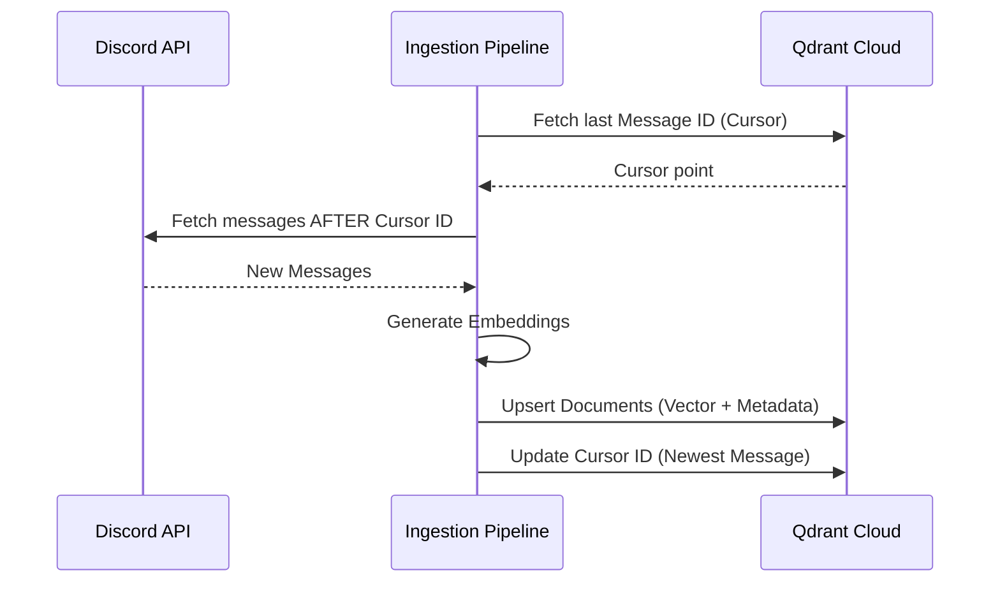

<p align="center">
  
</p>

# mAIcro: Open Source Knowledge Service

**mAIcro** is a professional, stateless AI service designed to centralize organizational knowledge and answer questions via RAG (Retrieval-Augmented Generation).

---

## System Architecture

mAIcro follows a modern, stateless architecture optimized for cloud deployment.


---

## Stateless Data Flow

mAIcro ensures zero-loss ingestion without local state by syncing cursors to the cloud.



---

## Quickstart

Setting up mAIcro takes less than 5 minutes.

#### 1. Zero-Clone Deployment (New)
You don't even need to clone this repo to run mAIcro. Just download these two files:
```bash
curl -O https://raw.githubusercontent.com/MicroClub-USTHB/mAIcro/main/docker-compose.yml
curl -O https://raw.githubusercontent.com/MicroClub-USTHB/mAIcro/main/.env.example
cp .env.example .env
```

#### 2. Configure Credentials
Open `.env` and fill in:
| Service | Purpose | Where to get it |
|---|---|---|
| **Google Gemini** | LLM & Embeddings | [Google AI Studio](https://aistudio.google.com/app/apikey) |
| **Discord Bot** | Data Source | [Discord Developer Portal](https://discord.com/developers/applications) |
| **Qdrant Cloud** | Stateless Memory | [Qdrant Cloud](https://cloud.qdrant.io) (Free 1GB tier) |

#### 3. Run
```bash
docker compose up -d
```
*Docker will automatically pull the image from GHCR and start the service.*
*The service is now alive at `http://localhost:8000`.*

#### 4. Ingest & Ask
```bash
# Sync Discord history to the cloud
curl -X POST http://localhost:8000/api/v1/ingest/discord

# Ask a question
curl -X POST http://localhost:8000/api/v1/ask \
  -H "Content-Type: application/json" \
  -d '{"question":"What projects are the dev team working on?"}'
```

---

## Features

- **Stateless Architecture**: No local database required. Ingestion cursors and embeddings are stored in Qdrant Cloud.
- **Discord Integration**: Automatically syncs announcements and messages from specified channels.
- **Production-Ready**: Multi-stage Docker builds and built-in health checks.
- **RAG-Powered**: Uses Gemini 1.5 Flash for fast, accurate organizational QA.

---

## Discord Bot Setup Tips

1. **Intents**: Enable **Message Content Intent** in the Discord Developer Portal.
2. **Permissions**: The bot needs `View Channels` and `Read Message History`.
3. **Channel IDs**: Enable Discord Developer Mode and right-click any channel to copy its ID.

---

## Project Structure

```text
.
├── src/maicro/
│   ├── api/           # HTTP routes & schemas
│   ├── core/          # Configuration & Ingestion logic
│   └── services/      # Business logic (QA system)
├── Dockerfile         # Optimized multi-stage build
├── docker-compose.yml # Service definitions
└── pyproject.toml     # Metadata & dependencies
```

---

> **Note:** This service is **Gemini-only** by default. Set `LLM_PROVIDER=google` in your `.env`.

## Contributing

We welcome professional contributions. Please see `CONTRIBUTING.md` for our development standards and `SECURITY.md` for reporting vulnerabilities.

---
© 2026 Micro Club. Released under the MIT License.


For new setups, prefer `maicro.main:app`.

---

# Core Concept

At its core, **mAIcro works as an AI service that understands provided data and answers questions based on it**.

Instead of relying on generic internet knowledge, the system operates on **specific datasets provided by the organization**.

These datasets may include:

* Official announcements
* Event information
* Internal documentation
* FAQs
* Structured data about activities or members

The AI processes this information and uses it to respond to user queries.

---

# Key Features

## Structured Data Understanding

mAIcro is designed to ingest and understand structured sources of information.
This allows it to reason about internal data rather than relying solely on general AI knowledge.

---

## Question Answering

Members can ask questions in natural language and receive answers derived directly from the organization's data.

Example questions:

* When is the next event?
* Where can I apply for the AI team?
* What are the rules for joining a workshop?

---

## Information Centralization

Organizations often have information scattered across multiple platforms:

* Discord
* Google Docs
* Notion
* Spreadsheets
* Announcements

mAIcro centralizes these sources into a **single AI-accessible knowledge system**.

---

## Adaptable Architecture

The system is designed so that it can be **adapted to different organizations** without rebuilding everything.

Possible use cases include:

* Student clubs
* Online communities
* Companies
* NGOs
* Developer communities

---

# Open Source Philosophy

mAIcro is released as an **open-source project**.

This means:

* Anyone can use the system
* Anyone can adapt it for their own community
* Anyone can contribute improvements

The goal is to build **shared AI infrastructure** that communities can deploy easily.

---

# First Deployment: Micro Club

The first deployment of mAIcro is within **Micro Club**.

In this environment, the system will:

* process official club announcements
* answer questions from members
* provide information about events, teams, and opportunities

However, **Micro Club is only the first use case**.
The architecture is designed to be reused by other communities.

---

# Future Extensions

mAIcro can evolve beyond a question-answering service.

Possible future features include:

### Agentic AI Features

The system may incorporate AI agents capable of:

* automating workflows
* summarizing announcements
* notifying members about relevant events
* managing knowledge updates

---

### Multi-Platform Integration

Future integrations may include:

* Discord
* Web dashboards
* APIs for other tools
* Knowledge management platforms
