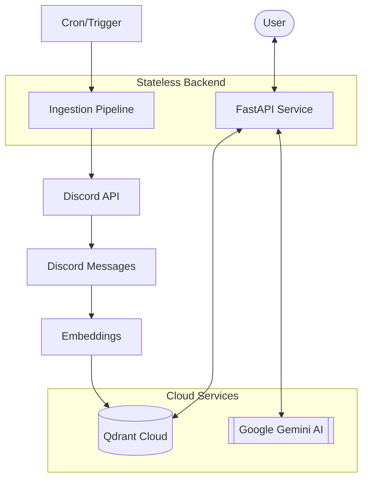
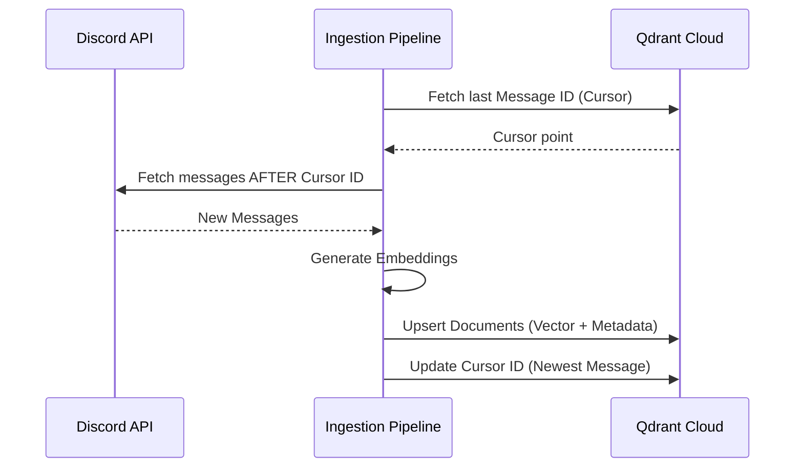

# mAIcro: Open Source Knowledge Service


**mAIcro** is an open-source AI service designed to centralize organizational knowledge and answer questions via RAG (Retrieval-Augmented Generation). It features a stateless architecture optimized for cloud deployment, automatic Discord integration, and production-ready performance.

## Table of Contents

- [Quick Start](#quick-start)
- [Features](#features)
- [How It Works](#how-it-works)
- [Architecture](#architecture)
- [Discord Bot Setup](#discord-bot-setup)
- [Project Structure](#project-structure)
- [Use Cases](#use-cases)
- [Future Extensions](#future-extensions)
- [Contributing](#contributing)

---

## Quick Start

Setting up mAIcro takes less than 5 minutes.

### 1. Configure Credentials

Open `.env` and fill in:

| Service | Purpose | Environment Variable |
|---|---|---|
| **Google Gemini** | LLM & Embeddings | `GEMINI_API_KEY` |
| **Discord Bot** | Data Source | `DISCORD_BOT_TOKEN` |
| **Qdrant Cloud** | Vector Database | `QDRANT_URL`, `QDRANT_API_KEY` |
| **Discord Channels IDS** | IDs of important channels in your discord | `DISCORD_CHANNEL_IDS` |

### 2. Run

You can run mAIcro in two ways:

**Method A: Clone the repository and run with Docker Compose**

```bash
git clone https://github.com/MicroClub-USTHB/mAIcro.git
cd mAIcro
docker compose up -d
```

This starts the app from the repository using the Compose service.

**Method B: Pull the GHCR image directly and run it as a service**

Both methods expose the API at `http://localhost:8000`.

### 3. Ingest & Ask

```bash
# Sync Discord history to Qdrant
curl -X POST http://localhost:8000/api/v1/ingest/discord

# Ask a question
curl -X POST http://localhost:8000/api/v1/ask \
  -H "Content-Type: application/json" \
  -d '{"question":"What projects are the dev team working on?"}'
```

---

## Features

- **Stateless Architecture** — No local database required. Cursors and embeddings stored in Qdrant Cloud.
- **Discord Integration** — Automatically syncs announcements and messages from specified channels.
- **Production-Ready** — Multi-stage Docker builds with built-in health checks.
- **RAG-Powered** — Uses Google Gemini for fast, accurate organizational QA.
- **Structured Data Understanding** — Reasons about internal data instead of generic internet knowledge.
- **Information Centralization** — Unifies Discord, Docs, Notion, spreadsheets, and announcements into one AI system.

---

## How It Works

At its core, mAIcro is an AI service that understands your organization's data and answers questions based on it.

**Data sources** may include:
- Official announcements
- Event information
- Internal documentation
- FAQs
- Structured activity logs

**Example questions members can ask:**
- When is the next event?
- Where can I apply for the AI team?
- What are the rules for joining a workshop?

The system processes this information and responds with answers derived directly from your organization's data, not generic AI knowledge.

---

## Architecture

### System Overview

mAIcro follows a modern, stateless architecture optimized for cloud deployment:



### Stateless Data Flow

mAIcro ensures zero-loss ingestion without local state by syncing cursors to the cloud:



---

## Discord Bot Setup

### Enable Intents & Permissions

1. Open the [Discord Developer Portal](https://discord.com/developers/applications)
2. Navigate to your application and enable **Message Content Intent**
3. Grant the bot these permissions:
   - `View Channels`
   - `Read Message History`

### Add Bot to Your Server

4. Copy the bot token to `DISCORD_BOT_TOKEN` in `.env`
5. In **OAuth2 > URL Generator**, select `bot` scope and `Read Messages/View Channels` + `Read Message History` permissions
6. Use the generated URL to invite the bot to your Discord server

### Configure Channels

7. Enable Discord Developer Mode (User Settings > Advanced > Developer Mode)
8. Right-click any channel and copy its ID
9. Add channel IDs to your configuration

---

## Project Structure

```text
.
├── src/
│   ├── api/           # HTTP routes & schemas
│   ├── core/          # Configuration & ingestion logic
│   ├── services/      # Business logic (QA system)
│   └── main.py        # Application entrypoint
├── tests/             # Unit & integration tests
├── Dockerfile         # Optimized multi-stage build
├── docker-compose.yml # Service definitions
└── pyproject.toml     # Dependencies & metadata
```

> **Note:** This service uses **Google Gemini** by default. Set `LLM_PROVIDER=google` in your `.env`.

---

## Use Cases

mAIcro is designed to be **adaptable to different organizations** without rebuilding from scratch. Possible deployments include:

- **Student Clubs** Centralize event info, team opportunities, and FAQs
- **Online Communities** Consolidate announcements and member documentation
- **Companies** Unify internal policies, documentation, and knowledge bases
- **NGOs** Provide instant access to mission-critical information
- **Developer Communities** Answer technical questions based on shared resources

---

## Future Extensions

mAIcro can evolve beyond question-answering. Planned features include:

### Agentic AI
- Automate workflows
- Summarize announcements
- Notify members about relevant events
- Manage knowledge updates autonomously

### Multi-Platform Integration
- Web dashboards
- APIs for third-party tools
- Notion, Google Docs, Slack integrations
- Knowledge management platforms

---

## Contributing

We welcome professional contributions. Please see [CONTRIBUTING.md](CONTRIBUTING.md) for development standards and [SECURITY.md](SECURITY.md) for reporting vulnerabilities.

---

© 2026 Micro Club. Released under the MIT License.
