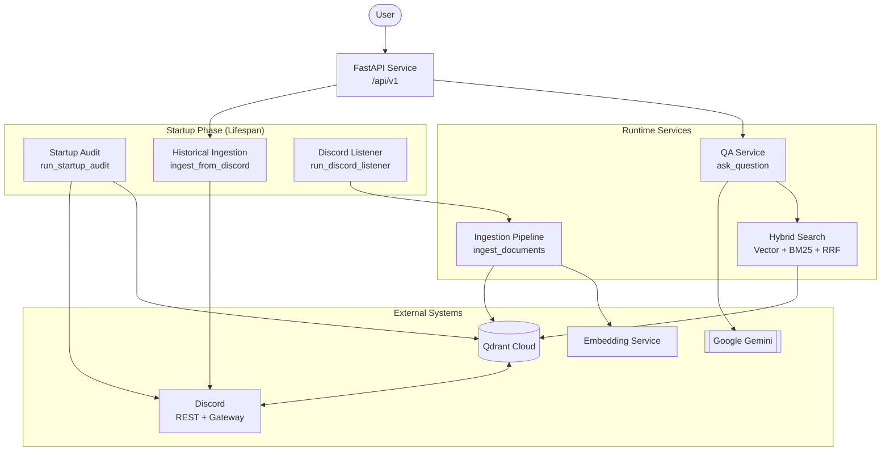

<div align="center">
  
</div>
<br />

# mAIcro: Open Source Knowledge Service

**mAIcro** is an open-source AI service designed to centralize organizational knowledge and answer questions via RAG (Retrieval-Augmented Generation). It features a stateless architecture optimized for cloud deployment, automatic Discord integration, and production-ready performance.

## Table of Contents

- [Features](#features)
- [Quick Start](#quick-start)
- [Configuration](#configuration)
- [Discord Bot Setup](#discord-bot-setup)
- [Architecture](#architecture)
- [API Reference](#api-reference)
- [Deployment](#deployment)
- [Use Cases](#use-cases)
- [Future Extensions](#future-extensions)
- [Contributing](#contributing)

---

## Features

- **RAG-Powered Q&A**: Google Gemini with hybrid search (semantic vector + keyword BM25) and Reciprocal Rank Fusion
- **Real-Time Discord Sync**: Gateway WebSocket listener handles message CREATE, EDIT, and DELETE instantly
- **Temporal Query Intelligence**: Understands "what happened today?" and "what was the last message?"
- **Question Normalization**: Rewrites slang ("whats", "wanna", "gonna"), augments time-aware queries
- **Startup Audit**: Reconciles offline Discord edits and deletes on every restart
- **Stateless Architecture**: All cursors and vectors live in Qdrant Cloud; no local database
- **Rate Limit Resilience**: Exponential backoff with jitter plus optional secondary LLM fallback
- **Production-Ready**: Multi-stage Docker, health checks, graceful reconnection

---

## Quick Start

There are two easy ways to run mAIcro locally. The recommended method does NOT require cloning the repository, it pulls and runs the published GHCR image.

1. Run the published GHCR image (recommended)

Pull & run the image directly with Docker:

```bash
docker pull ghcr.io/microclub-usthb/maicro:latest
docker run --env-file .env -p 8000:8000 ghcr.io/microclub-usthb/maicro:latest
```

2. Clone and run from source (for development or when you want to build locally)

```bash
git clone https://github.com/MicroClub-USTHB/mAIcro.git
cd mAIcro
cp .env.example .env
# Uncomment the `build: .` line in docker-compose.yml, then:
docker compose build
docker compose up -d
```

Fill in `.env` (see the [Configuration](#configuration) section below). The API is available at `http://localhost:8000`. Interactive docs are disabled by default and can be enabled with `EXPOSE_API_DOCS=true`.

### Ingest and query

```bash
# Sync Discord message history to Qdrant
curl -X POST http://localhost:8000/api/v1/ingest/discord \
  -H "X-API-Key: ${API_KEY}"

# Ask a question
curl -X POST http://localhost:8000/api/v1/ask \
  -H "X-API-Key: ${API_KEY}" \
  -H "Content-Type: application/json" \
  -d '{"question":"When is the next event?"}'
```

---

## Configuration

All settings are environment variables loaded from `.env` via `pydantic-settings`.

### Required

| Variable              | Description                                                      |
| --------------------- | ---------------------------------------------------------------- |
| `API_KEY`             | Shared secret required for protected API routes                  |
| `GEMINI_API_KEY`      | Google Gemini API key (used for LLM + embeddings)                |
| `QDRANT_URL`          | Qdrant Cloud instance URL (e.g. `https://xxxxx.cloud.qdrant.io`) |
| `QDRANT_API_KEY`      | Qdrant Cloud API key                                             |
| `DISCORD_BOT_TOKEN`   | Discord bot token (from the Developer Portal)                    |
| `DISCORD_CHANNEL_IDS` | Comma-separated Discord channel IDs to watch                     |

### Optional

| Variable                   | Default                               | Description                                                        |
| -------------------------- | ------------------------------------- | ------------------------------------------------------------------ |
| `API_AUTH_ENABLED`         | `true`                                | Protects sensitive routes with the shared API key                  |
| `API_KEY_HEADER`           | `X-API-Key`                           | Header used to send the shared API key                             |
| `EXPOSE_API_DOCS`          | `false`                               | Enables `/docs`, `/redoc`, and the OpenAPI schema when set to true |
| `ORG_NAME`                 | `MicroClub`                           | Organization name embedded in the AI system prompt                 |
| `ORG_DESCRIPTION`          | `A generic organization using mAIcro` | Organization description                                           |
| `GOOGLE_MODEL_NAME`        | `gemini-2.5-flash`                    | Gemini model used for answering                                    |
| `SECONDARY_GEMINI_API_KEY` | (none)                                | Fallback Gemini key when the primary is rate-limited               |
| `LLM_FALLBACK_ENABLED`     | `false`                               | Set to `true` to enable automatic fallback to the secondary key    |
| `COLLECTION_NAME`          | `microclub_knowledge`                 | Name of the Qdrant collection                                      |
| `HYBRID_SEARCH_ALPHA`      | `0.7`                                 | Blend weight between vector and keyword search (1.0 = vector only) |
| `HYBRID_SEARCH_RRF_K`      | `60`                                  | RRF constant used in result fusion                                 |

---

## Discord Bot Setup

1. Go to the [Discord Developer Portal](https://discord.com/developers/applications) and create an application
2. Navigate to **Bot** → enable **Message Content Intent** under Privileged Gateway Intents
3. Under **OAuth2 > URL Generator**, select `bot` scope and permissions: `Read Messages/View Channels` + `Read Message History`
4. Use the generated URL to invite the bot to your server
5. Copy the bot token (from the Bot page) into `DISCORD_BOT_TOKEN`
6. Enable **Developer Mode** in Discord (User Settings → Advanced → Developer Mode)
7. Right-click the channels you want to watch → **Copy Channel ID** → paste into `DISCORD_CHANNEL_IDS` (comma-separated)

---

## Architecture

### System Overview



### Question Answering Flow

```mermaid
sequenceDiagram
    participant U as User
    participant API as FastAPI
    participant QA as qa_service
    participant HS as Hybrid Search
    participant QD as Qdrant
    participant LLM as Gemini

    U->>API: POST /ask {question}
    API->>QA: ask_question(question)

    rect rgb(30, 50, 60)
        Note over QA: Special query detection
        alt "today" or "last message"
            QA->>QD: scroll(order_by timestamp DESC)
            QD-->>QA: filtered messages
            QA->>LLM: answer from messages
        else Normal query
            QA->>QA: normalize (whats→what is)
            QA->>HS: hybrid_search(query, k=6)
            HS->>QD: vector similarity
            HS->>QD: BM25 keyword match
            HS->>QD: Reciprocal Rank Fusion
            QD-->>HS: ranked documents
            HS-->>QA: top-k documents
            QA->>QA: format context (≤6000 chars)
            QA->>LLM: invoke(prompt + context)
        end
    end

    LLM-->>QA: answer
    QA-->>API: answer
    API-->>U: {question, answer}
```



### How Discord Sync Works

On startup, the app runs three tasks in parallel:

1. **Audit** (`run_startup_audit`): Fetches the last 200 messages before the cursor from each channel. Compares them against Qdrant. Deletes any points that no longer exist in Discord (offline deletes) and updates content that was edited offline.

2. **Historical Ingest** (`ingest_from_discord`): Fetches all messages _after_ each channel's cursor via the Discord REST API. Converts them to LangChain Documents, generates embeddings, and upserts them into Qdrant.

3. **Real-Time Listener** (`run_discord_listener`): Connects to the Discord Gateway via WebSocket. Listens for `MESSAGE_CREATE`, `MESSAGE_DELETE`, and `MESSAGE_UPDATE` events. Ingests, deletes, or updates Qdrant points accordingly. Automatically reconnects with exponential backoff on disconnect.

---

## API Reference

| Method | Path                     | Description                          |
| ------ | ------------------------ | ------------------------------------ |
| `GET`  | `/api/v1/health`         | Service health check                 |
| `POST` | `/api/v1/ask`            | Answer a question via RAG            |
| `POST` | `/api/v1/ingest/discord` | Trigger Discord historical ingestion |

### Examples

```bash
# Health check
curl http://localhost:8000/api/v1/health
# {"status":"ok","service":"mAIcro","version":"0.1.0","org":"MicroClub","llm_provider":"google"}

# Ask a question
curl -X POST http://localhost:8000/api/v1/ask \
  -H "X-API-Key: ${API_KEY}" \
  -H "Content-Type: application/json" \
  -d '{"question":"What are the rules for joining a workshop?"}'
# {"question":"What are the rules for joining a workshop?","answer":"..."}

# Trigger ingestion
curl -X POST http://localhost:8000/api/v1/ingest/discord \
  -H "X-API-Key: ${API_KEY}"
# {"status":"ok","documents_ingested":42,"details":{"channels":{"123456789":42},"errors":{}}}
```

---

## Deployment

### Development

```bash
docker compose -f docker-compose.dev.yml up -d
```

Includes mAIcro and a local Qdrant instance for testing without cloud credentials.

### Production

The published GHCR image is public, but the API itself now expects an `API_KEY` for sensitive routes by default.

```bash
docker compose up -d
```

This pulls `ghcr.io/microclub-usthb/maicro:latest` by default. To use a specific tagged image instead:

```bash
MAICRO_IMAGE=ghcr.io/microclub-usthb/maicro:sha-<hash> docker compose up -d
```

Or pull & run directly with Docker:

```bash
docker pull ghcr.io/microclub-usthb/maicro:latest
docker run --env-file .env -p 8000:8000 ghcr.io/microclub-usthb/maicro:latest
```

---

## Use Cases

- **Student Clubs**: Event info, team opportunities, FAQs, and workshop announcements
- **Online Communities**: Consolidated announcements and member documentation
- **Companies**: Internal policies, documentation, and knowledge bases
- **NGOs**: Instant access to mission-critical organizational information
- **Developer Communities**: Technical Q&A grounded in shared resources and past discussions

---

## Future Extensions

- **Agentic AI**: Automate workflows, summarize announcements, notify members about events
- **Multi-Platform Integration**: Notion, Slack, Google Docs, and other knowledge platforms
- **Web Dashboard**: Visual knowledge browser and query analytics
- **Third-Party API**: Public API for external tool integrations

---

## Contributing

Contributions are welcome. Please read [CONTRIBUTING.md](CONTRIBUTING.md) before submitting PRs.

---

## License

MIT License. © 2026 Micro Club.
